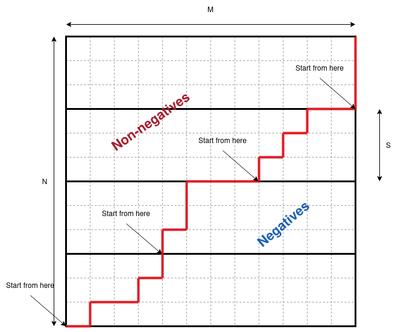
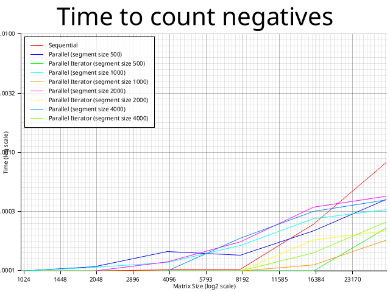
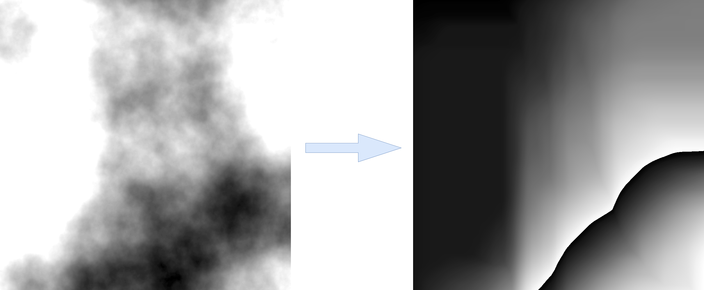

# Counting negatives in sorted matrix in parallel

## Running the code

I had a problem running code with plots, [this](https://github.com/plotters-rs/plotters/issues/10) fixed it. I was running on Ubuntu 22.04.

```bash
sudo apt-get install libfontconfig libfontconfig1-dev
```

Cargo version: `cargo 1.81.0`


## The problem

The problem on leetcode:
https://leetcode.com/problems/count-negative-numbers-in-a-sorted-matrix/

>Given a `m x n` matrix grid which is sorted in non-increasing order both row-wise and column-wise, return the number of negative numbers in grid.

The sequential solution for the problem is starting from bottom-left corner follow the frontier between positive and negatives and add up negatives to the left of it.
So we are moving right until we meet the negative number and after we add the number of negatives in this row to the `sum` and move up.

This way to complete the algorithm for $N \times M$ matrix we need $N$ horizontal and $M$ vertical steps. So the complexity of the algorithm is $O(N + M)$.

here is the sequential implementation.

```rust
fn count_negatives(grid: Vec<Vec<i32>>) -> i32 {
    let rows = grid.len(); // N
    let columns = if rows > 0 { grid[0].len() } else { 0 }; // M

    let mut sum : i32 = (rows as i32) * (columns as i32);

    let mut i : usize = rows - 1;
    let mut j : usize = 0;

    loop {
        while j < columns && grid[i][j] >= 0 { j += 1; }
        sum -= j as i32;
        if i == 0 { break; }
        i -= 1;
    }

    sum
}
```


## Parallel version

### Division into subtasks
We will split the matrix horizontaly into several blocks. In each the algorithm will calculate the number of negatives, after all the values are added up.

Applying the same algorithm as before for each block in inefficient as the complexity inside the block would be $O(M + S)$, where $S$ is the number of rows in each block. With the increase of the number of blocks $K$ the number of rows in the block decreases being $S = \frac{N}{K}$, however the number of columns $M$ is constant.

This way the time complexity is $O(N + M \cdot K)$.

The better option is to use binary search to find the intersection of frontier with the bottom edge of the block. Overall there will be $K$ binary search operations, $N$ vertical and $M$ horizontal steps.

The time complexity in this scenario is $O(N + M + K \cdot log_2M)$.



For a subtask we define function `count_negatives_segment` that calculates the number of negatives in the segment of the matrix.

The code for this function is almost the same as for `count_negatives`, with the difference that the search starts not from bottop-left corner, but from intersection of bottom edge and the frontier (i.e. the first negative number in the row).

```rust
fn count_negatives_segment(grid: &Vec<Vec<i32>>, begin: usize, end: usize) -> i32 {
    let rows: usize = grid.len();
    let columns = if rows > 0 { grid[0].len() } else { 0 };
    let gap = end - begin;
    let mut sum : i32 = (gap as i32) * (columns as i32);
    
    // Binary search for the first negative number in the row
    let first_negative = find_first_negative(&grid[end - 1]);
    if first_negative == -1 { return 0; }

    let mut i : usize = end - 1;
    let mut j : usize = first_negative as usize;

    loop {
        while j < columns && grid[i][j] >= 0 {
            j += 1;
        }
        sum -= j as i32;

        if i == begin { break; }

        i -= 1;

    }
    sum
}
```


### With join

The simplest way to implement the parallel version is to use `rayon` library with join function.

```rust
fn count_negatives_par_inner(grid: &Vec<Vec<i32>>, begin: usize, end: usize, segment_size: usize) -> i32 {
    if end - begin <= segment_size {
        let res = count_negatives_segment(grid, begin, end);
        return res;
    }

    let mut a : i32 = 0;
    let mut b : i32 = 0;
    let mid = (begin + end) / 2;

    join(
        || a = count_negatives_par_inner(grid, begin, mid, segment_size),
        || b = count_negatives_par_inner(grid, mid, end, segment_size)
    );

    a + b
}
```

### With parallel iterators

The other way is using parallel iterators. Divide the matrix into chunks and calculate the number of negatives in each chunk, than reduce the results.

```rust
fn count_negatives_par_iter(grid: &Vec<Vec<i32>>, segment_size: usize) -> i32 {
    grid.par_chunks(segment_size)
        .enumerate()
        .map(|(i, segment)| {
            let begin = i * segment_size;
            let end = begin + segment.len();
            count_negatives_segment(grid, begin, end)
        })
        .sum()
}
```

### Evaluation

Those three different implementations of algorithm (sequential, parallel with join, parallel with itarators) were tested on set of square matricies of different sizes. Also different block sizes were used. The results are presented on the plot below.

On given plot each configuration was tested 10 times and the average time was taken.

Due to the hardware limitation the maximum size of the matrix was 32000x32000. For this size the program was consuming about 4GB of RAM and the matrix generation was taking around 30 seconds.

This way it is hard to measure the advantage of parallel version because The algorithm is linear in repsect to the linear size of the matrix.

However it is evident that after the size of 8000-16000 the parallel versions become faster than sequential. And it can be clearly seen that the parallel version with iterators is performing better than the one with join.

Changing the size of the block does not seem to affect the result. This may be due to not enough size of the matrix.



### Matrix generation

To generate diverse family of matricies with different features Perlin noise is used. The matrix generation occurs in 2 steps:
1. The noise matrix is created using Perlin noise.
2. The matrix is reduced into decreasing matrix.

Perlin noise generation is done via `noise` library.

Values below zero are cropped to zero.

The reduction is done via formula that guarantees the increase of values:

$m[i][j] = max(m[i-1][j], m[i][j-1]) + m_n[i][j]$ where $m_n$ is noise matrix.

After values in $m$ are normalized between $+max$ and $-max$ and negated.

Image below shows the noise matrix and the corresponding reduced matrix:

